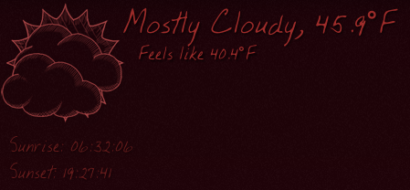

# Geeklets-Weather



Geektool scripts for getting weather data via forecast.io and runs with Python. The main script downloads the JSON data to your /private/tmp/ and the others scripts parse it to display only certain information. This way, you can arrange them in different places and style them differently.

The [**The Dark Sky Forecast API**](https://developer.forecast.io/) has a lot of other information, which I haven't tapped into, but it should be easy enough to add some more scripts.

## Setup
1. [Register for **The Dark Sky Forecast API**](https://developer.forecast.io/register), and note your APIKEY
2. Find the latitude and longitude of the place you want the forecast of
3. Copy *GeekWeatherImages* to `~/Library/Application Support/`. Inside there are subfolders for different styles of icons to display. In the screen shot above, I have it set to *sketchy-weather-red*.
4. Copy the *GeektoolWeather* somewhere to you drive, I put them in `~/Documents/Geeklets`
5. Edit **Weather.py** with the following information
   * **api** - The APIKEY from The Dark Sky Forecast API
   * **latitude** - The latitude of the location where you want the weather of
   * **longitude** - The longitude of the location where you want the weather of
   * **whichStyle** - The name of the sub-folder of GeektoolWeatherImages to get the image from.
   
   In my case it looks something like this:
   ```py
    api = "00NOTaREALapiKEYfromFORECASTio00"
    # Location
    latitude = "40.873628"
    longitude = "-74.13577"
    # Which style of icons to use
    whichStyle = "sketchy-weather-red"
    ```
6. Create a Shell Geeklet and set the command to `python ~/Documents/Geeklets/Weather.py` or where ever you placed your script. I set it to refresh every 2 minutes to avoid going over the limit for 1000/day for free. 

## Displaying information
Now, you can choose to display the information you want, and everything will be parsed from that JSON file. I also set the update to about 30 seconds on my machine.

### Weather Image
Create an Image Geeklet and set the URL to `file://localhost/private/tmp/weather.png`.

### Description
To display text of the current weather and temperature, create a Shell Geeklet and set the command to `python ~/Documents/Geeklets/Description.py`

### "Feels Like" temperature
To display what temperature it feels like, if there is a temperature difference of more than 5 degrees, create a Shell Geeklet and set the command to `python ~/Documents/Geeklets/FeelsLike.py`, 

### Sunrise, Sunset
If you want to display the sunrise and sunset times, create a Shell Geeklet and set the command to `python ~/Documents/Geeklets/SunriseSunset.py`

## Images
### Naming Convention
Images are named based upon the 1 - 49 and end in either a "d" for day time image, or "n" for the nighttime variation.

###Attributes
* *reflective/* - From [By Stardock Corporation](http://www.wincustomize.com/explore/objectdock/15339/). Copied the file to include the "d" and "n" for day and night.
* *sketchy-weather/* - From [Sketchy Weather Icons by AzureSol](http://azuresol.deviantart.com/art/Sketchy-Weather-Icons-135079063). Copied the file to include the "d" and "n" for day and night. 
* *sketchy-weather-red/* - Based on [Sketchy Weather Icons by AzureSol](http://azuresol.deviantart.com/art/Sketchy-Weather-Icons-135079063). Copied the file to include the "d" and "n" for day and night and recolored the images.
* *weather-images-shiny/* - From [Weather Icons Shiny by JyriK](http://jyrik.deviantart.com/art/Weather-Icons-Shiny-5215175). Renamed files and included "d" and "n" in the names to go with the format, and removed unused icons.
